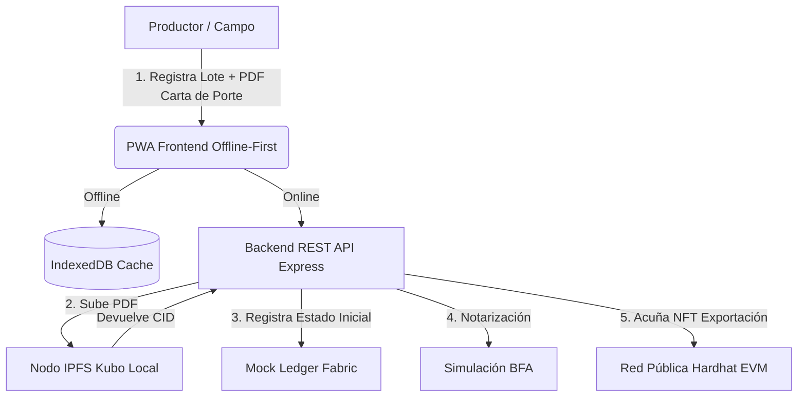

# Guía de Funcionamiento del Sistema de Trazabilidad de Maíz

Esta guía detalla el funcionamiento paso a paso de cada uno de los archivos del proyecto, permitiendo comprender la arquitectura de la solución, sus flujos de datos y la integración de tecnologías (blockchain permisionada, almacenamiento descentralizado, blockchain pública y lógica offline-first).

---

## 🏗️ Arquitectura General del Sistema

El sistema implementa una **Arquitectura Blockchain Híbrida** diseñada para la cadena de suministro agroindustrial. Se divide de la siguiente manera:

1. **Capa Transaccional Privada (Hyperledger Fabric Mock)**: Registra el ciclo logístico completo del grano de forma confidencial mediante un consorcio de actores autorizados.
2. **Almacenamiento Descentralizado (IPFS)**: Aloja documentos regulatorios (Carta de Porte Electrónica) sin sobrecargar la blockchain.
3. **Capa Notarial Pública (Simulación BFA)**: Sella criptográficamente el estado del lote en la Blockchain Federal Argentina.
4. **Capa de Tokenización de Exportación (Hardhat/Ethereum)**: Emite un NFT (ERC-721) que representa la propiedad y trazabilidad inmutable del lote para el mercado internacional.
5. **Acceso Sin Conexión (Offline-First)**: Emplea Service Workers e IndexedDB en dispositivos móviles para permitir que los productores registren la cosecha directamente en el lote agrícola, sin señal de red.

---

## 🗂️ Estructura del Proyecto y Detalle de Archivos

### 1. Capa de Middleware y Orquestación (Backend)

El backend actúa como el orquestador o "puente" entre la interfaz de usuario, la base de datos privada, IPFS y la blockchain pública.

#### 📄 [backend/server.js](file:///home/fernandop/Documents/blockchain_thesis_project/backend/server.js)
Es el servidor principal del sistema escrito en **Node.js** con **Express**. Sus funciones principales son:
* **Autenticación (JWT)**: Contiene una base de usuarios predefinidos con roles específicos (Productor, Transportista, Acopiador, SENASA, Exportador). Al autenticar, emite un JSON Web Token (JWT) con el rol del usuario para restringir accesos mediante el middleware `verificarRol`.
* **Oráculo de Documentos**: En el endpoint de registro, recibe el archivo PDF de la Carta de Porte y utiliza `pdf-parse` para validar que contenga las leyendas `"CARTA DE PORTE ELECTRÓNICA"` y `"CTG"`. Si no las tiene, rechaza el registro (actúa como oráculo validador).
* **Integración con IPFS**: Envía el buffer del PDF validado al servicio de IPFS y recibe un identificador de contenido (CID) único e inmutable.
* **Integración con la Blockchain Pública (EVM/Hardhat)**: En el endpoint de exportación, utiliza la biblioteca `ethers` para conectarse al nodo local de Hardhat. Firma transacciones usando la cuenta por defecto del nodo para interactuar con el contrato inteligente y acuñar (mint) un certificado de exportación en forma de NFT (ERC-721).
* **Máquina de Estados Agroindustrial de 8 Fases**: Expone los endpoints para que cada actor modifique el estado logístico del lote según las reglas de negocio estrictas de la cadena agroindustrial:
  * **1. Productor Agrícola**: Registra la cosecha en campo con su Carta de Porte Primaria (`COSECHADO`).
  * **2. Transportista (Tramo 1 - Flete Corto)**: Inicia el traslado hacia la planta de acopio (`EN_TRANSITO_ACOPIO` / `EN_TRANSITO`).
  * **3. Acopiador / Cooperativa (Balanza y Silos)**:
    * **Recepción en Balanza**: Confirma la descarga física y pesa el camión (`RECEPCIONADO_ACOPIO`).
    * **Acondicionamiento y Mezcla**: Ejecuta tareas de secado, zarandeo, fumigación y tipificación comercial (`ACOPIADO_ACONDICIONADO`). Si mezcla partidas, preserva los precursores en `MEZCLADO_ACONDICIONADO` previniendo el doble gasto de masa.
    * **Emisión de CPE de Traslado (Tramo 2)**: Emite la nueva CPE con destino portuario específico (Bahía Blanca o Quequén) una vez obtenida la certificación oficial (`EN_TRANSITO_PUERTO`).
  * **4. SENASA / ARCA (Fiscalización Fitosanitaria)**:
    * **Momento de Emisión del Certificado**: Se emite una vez ingresado y acondicionado el grano en el silo. Valida el lote físico libre de plagas cuarentenarias y estampa la conformidad fitosanitaria en BFA (`VALIDADO_SENASA`).
    * **Bloqueo Preventivo**: Emite alertas fitosanitarias cautelares ante detección de anomalías sanitarias (`BLOQUEADO`).
  * **5. Exportador / Terminal Portuaria (Despacho Internacional)**:
    * **Arribo Portuario**: Valida el ingreso del convoy y confirma la CPE de descarga (`ARRIBADO_PUERTO`).
    * **Habilitación para Embarque**: Lista el lote como habilitado para embarque únicamente si cumple concurrentemente con las 3 condiciones: (1) CPE de descarga confirmada, (2) Sello BFA comprobable, (3) Trazabilidad de masa acreditada hacia atrás.
    * **Cierre Logístico**: Acuña el NFT ERC-721 en la blockchain EVM (Hardhat/Polygon) (`EXPORTADO`).

#### 📄 [backend/services/ipfsService.js](file:///home/fernandop/Documents/blockchain_thesis_project/backend/services/ipfsService.js)
Clase encargada de la comunicación directa con el servicio local de IPFS (Kubo).
* Se conecta a la API HTTP local de Kubo (`http://127.0.0.1:5001/api/v0`).
* Su método `uploadRegulatoryDocument` recibe el archivo temporal en memoria, construye una petición de tipo `multipart/form-data` usando la librería `form-data`, y lo envía mediante `axios` al endpoint `/api/v0/add`.
* Retorna el **CID (Content Identifier)** del archivo almacenado, el cual es inmutable y sirve como prueba matemática de existencia.

---

### 2. Capa Transaccional Privada (Consorcio)

#### 📄 [blockchain-private-mock/fabricMockLedger.js](file:///home/fernandop/Documents/blockchain_thesis_project/blockchain-private-mock/fabricMockLedger.js)
Emulador en memoria del libro mayor (**World State**) y el código de contrato inteligente (**Chaincode**) de Hyperledger Fabric.
* Utiliza una estructura `Map` de JavaScript para simular la base de datos de estado.
* Emplea un patrón de diseño **Singleton** para persistir la información durante la ejecución del proceso del backend.
* Define la estructura de datos del objeto `LoteMaiz` con campos críticos como `id`, `renspa`, `geolocalizacion`, `volumenToneladas`, `estado`, `ipfsCID`, `bfaHash`, `cpeTraslado`, `arriboPuerto`, `inspeccionSenasa`, `acondicionamiento`, y el historial cronológico de transacciones.
* Implementa las funciones transaccionales:
  * `registrarCosechaPrimaria`: Crea y valida que el lote no exista previamente en el World State (`COSECHADO`).
  * `procesarAcopioYMezcla`: Exige recepción previa en balanza (`RECEPCIONADO_ACOPIO`), acondiciona y consolida en silos (`ACOPIADO_ACONDICIONADO`), mutando los precursores a `MEZCLADO_ACONDICIONADO` para prevenir reutilizaciones fraudulentas.
  * `notarizarSenasa`: Exige lote acondicionado en silo y ausencia de plagas cuarentenarias, estampando el hash de BFA y transicionando a `VALIDADO_SENASA`.
  * `emitirCpeTraslado`: Valida certificación fitosanitaria y restringe destinos a `Puerto de Bahía Blanca` o `Puerto de Quequén`, transicionando a `EN_TRANSITO_PUERTO`.
  * `confirmarArriboPuerto`: Valida llegada a terminal portuaria y confirma la CPE de descarga (`ARRIBADO_PUERTO`).
  * `verificarHabilitadoParaEmbarque`: Evalúa concurrentemente: (1) Arribo y CPE de descarga confirmada, (2) Sello BFA comprobable, (3) Trazabilidad de masa hacia atrás completa.
  * `obtenerTrazabilidadCompleta`: Algoritmo de backtracking recursivo inverso que resuelve el árbol genealógico de mezclas y calcula on-the-fly el porcentaje exacto de participación de cada cosecha primaria precursor (% Participación = [Volumen Origen / Volumen Total Mezcla] * 100).
  * `actualizarEstadoLogistico`: Modifica el estado del lote y añade una firma (actor, fecha y detalles de la acción) al arreglo `historialTransacciones`, garantizando la inmutabilidad lógica del historial de eventos.

---

### 3. Capa de Tokenización Pública (Blockchain Pública)

#### 📄 [blockchain-public/contracts/TrazabilidadMaizNFT.sol](file:///home/fernandop/Documents/blockchain_thesis_project/blockchain-public/contracts/TrazabilidadMaizNFT.sol)
Contrato Inteligente escrito en **Solidity** (^0.8.24).
* Hereda de `ERC721URIStorage` de OpenZeppelin para emitir tokens no fungibles (NFT) con almacenamiento de metadatos externo, y de `Ownable` para restringir privilegios de acuñación.
* El constructor inicializa el token con el nombre *"Maiz Trazabilidad Argentina"* y el símbolo *"MAIZ"*.
* Define la función `emitirCertificadoExportacion(address exportador, string memory uri)`:
  * Solo puede ser invocada por el dueño del contrato (la cuenta que usa el backend).
  * Autoincrementa el identificador único del token (`_nextTokenId`).
  * Acuña de forma segura el NFT para el exportador (`_safeMint`).
  * Vincula el token con la URI (`_setTokenURI`) que contiene el JSON con la metadata del lote (volumen, RENSPA, geolocalización, hashes).
  * Emite el evento `LoteExportado` a la red pública.

#### 📄 [blockchain-public/scripts/deploy.js](file:///home/fernandop/Documents/blockchain_thesis_project/blockchain-public/scripts/deploy.js)
Script de automatización en JS para el despliegue del contrato.
* Utiliza el entorno de ejecución de **Hardhat** (`hre`).
* Obtiene la fábrica del contrato inteligente `TrazabilidadMaizNFT`, realiza el despliegue a la red y espera la confirmación en los bloques (`waitForDeployment`).
* Imprime en la consola la dirección hexadecimal resultante (`contract address`) para que sea configurada en el backend.

#### 📄 [blockchain-public/hardhat.config.js](file:///home/fernandop/Documents/blockchain_thesis_project/blockchain-public/hardhat.config.js)
Archivo de configuración del entorno de pruebas local de Ethereum.
* Configura la versión del compilador de Solidity (0.8.24) y la versión de la EVM compatible (Cancun).
* Define la red local que corre por defecto en el puerto `8545`.

---

### 4. Interfaz de Usuario e Integración Offline-First (Frontend)

El frontend está implementado bajo el concepto de **Aplicación Web Progresiva (PWA)**, permitiendo su instalación en dispositivos móviles y su funcionamiento autónomo sin acceso a Internet.

#### 📄 [frontend/public/index.html](file:///home/fernandop/Documents/blockchain_thesis_project/frontend/public/index.html)
Es el punto de entrada visual para los agentes logísticos autorizados.
* Contiene una estructura modular basada en divs (`panels`) que se muestran u ocultan dinámicamente según el rol detectado en la autenticación.
* Cuenta con secciones para:
  * Formulario del productor (con geolocalización automática por GPS y subida de archivos).
  * Panel logístico del transportista (con mapa integrado).
  * Panel del acopiador (para pesajes y calidad).
  * Consola de fiscalización de SENASA (con filtros de búsqueda e inicio de notarización/bloqueo).
  * Panel de exportación (para asociar direcciones de billeteras criptográficas).
* Muestra un indicador visual de conexión a Internet (`online` u `offline`) y una bitácora de eventos criptográficos en vivo en la parte inferior.

#### 📄 [frontend/public/app.js](file:///home/fernandop/Documents/blockchain_thesis_project/frontend/public/app.js)
Contiene toda la lógica operativa de la interfaz y la integración offline-first.
* **Control de Vista (RBAC)**: En la función `evaluarPantalla`, lee el rol almacenado en el almacenamiento local (`localStorage`) tras el inicio de sesión y despliega el formulario exacto correspondiente al rol.
* **Generación de ID del Lote**: Implementa una previsualización dinámica. Cuando el productor ingresa su RENSPA y sube un archivo, utiliza la Web Crypto API (`crypto.subtle.digest`) para generar un hash SHA-256 de los metadatos y el nombre del archivo. Los primeros 16 caracteres de este hash (con el prefijo `0x`) se utilizan como el identificador único del lote antes de enviarlo.
* **Persistencia Local (IndexedDB)**:
  * Si la conexión a Internet está activa, envía la transacción de registro directamente al backend REST.
  * Si el navegador se encuentra desconectado (o la variable `forceOffline` está activada), invoca el método `guardarOffline`. Esta función abre la base de datos local `AgTechDB`, accede al almacén de objetos `lotes_pendientes` y guarda el payload completo (incluyendo el archivo binario PDF).
* **Integración del Mapa y GPS**:
  * Utiliza la librería **Leaflet** y tiles de **OpenStreetMap** para renderizar un mapa interactivo.
  * Emplea el método `navigator.geolocation.watchPosition` para actualizar en tiempo real las coordenadas GPS del transportista mientras traslada el lote.
* **Sincronización Automática**:
  * Registra un evento de sincronización en segundo plano con el Service Worker (`sync-lotes`) cuando detecta que la red retorna a estado `online`.
  * Si el navegador no soporta el gestor de sincronización en segundo plano, ejecuta una función de respaldo (`sincronizarDatosOffline`) que recorre recursivamente IndexedDB y envía las transacciones acumuladas en lote al backend.

#### 📄 [frontend/public/sw.js](file:///home/fernandop/Documents/blockchain_thesis_project/frontend/public/sw.js)
El **Service Worker** de la PWA. Corre en un hilo separado del navegador.
* **Caché Estático**: En el evento `install`, descarga y almacena los archivos indispensables de la interfaz (`index.html`, `app.js`, CSS, etc.) en el caché local (`caches.open`).
* **Estrategia de Carga Network-First**: En el evento `fetch`, intercepta las peticiones de recursos. Intenta descargarlos desde el backend y, en caso de fallo por falta de señal, los sirve directamente desde el caché del navegador, logrando que la interfaz cargue de forma instantánea sin Internet. Excluye explícitamente los endpoints de la API (`/api/`) para no cachear datos transaccionales obsoletos.
* **Background Sync**: Escucha el evento `sync`. Al dispararse el tag `'sync-lotes'`:
  * Abre de forma asíncrona la base de datos de IndexedDB `AgTechDB`.
  * Recupera los lotes guardados localmente.
  * Realiza peticiones `POST` al backend para sincronizar los lotes en la blockchain principal.
  * Si la sincronización es exitosa, elimina los registros del almacén local para evitar duplicaciones.

#### 📄 [frontend/public/verificador.html](file:///home/fernandop/Documents/blockchain_thesis_project/frontend/public/verificador.html) y [frontend/public/verificador.js](file:///home/fernandop/Documents/blockchain_thesis_project/frontend/public/verificador.js)
Es el módulo público destinado al consumidor final o inspectores de aduana en puerto.
* **Acceso Público Sin Credenciales**: No requiere inicio de sesión ni token JWT.
* **Lectura de QR**: Al ser invocado mediante una URL con parámetros de consulta (ej. `?id=0x1a2b3c&tx=0x...`), el script lee el identificador del lote.
* **Cabecera Enriquecida**: Muestra el ID del Lote, badge de estado con código de color dinámico, volumen consolidado total, sello de tiempo BFA, código QR interactivo y enlace al contrato en Hardhat/Polygon.
* **Composición de Origen y Trazabilidad de Masa (Balance de Masa en Silos)**:
  * Si el lote proviene de una consolidación/mezcla (`desgloseOrigenes.length > 1`), renderiza un banner destacado de auditoría de silos y una tarjeta individual por cada lote precursor primario.
  * Cada tarjeta expone la **barra visual de progreso porcentual** y texto en negrita (ej. `40.0% de la carga (40.00 TN)`), el **RENSPA** del establecimiento agrícola, la **ubicación geográfica** con enlace directo a OpenStreetMap y el botón interactivo para descargar la **Carta de Porte Electrónica original desde IPFS**.
  * Si el lote es monovarietal directo, renderiza la tarjeta única tradicional con el 100% de participación.
* **Renderizado de la Línea de Tiempo de Trazabilidad en 6 Hitos Operativos**:
  * Realiza una consulta pública al backend `GET /api/lotes/:id`.
  * Si el lote existe, extrae su historial y genera una línea de tiempo estructurada que incluye:
    1. **Hito 1: Cosecha Primaria y Genealogía de Cosechas (Tramo 1)**: Desglose de aportes primarios, balance de masa en silos, RENSPA de cada productor, geolocalización satelital y Carta de Porte Electrónica Primaria (CID IPFS).
    2. **Hito 2: Acondicionamiento y Homogeneización en Silos**: Recepción física en balanza oficial de acopio, tipificación comercial y acondicionamiento sanitario (secado, zarandeo, fumigación reglamentaria).
    3. **Hito 3: Fiscalización Fitosanitaria SENASA y Notarización BFA**: Dictamen oficial libre de plagas cuarentenarias, calidad comercial tipificada y Sello Notarial SHA-256 en Blockchain Federal Argentina.
    4. **Hito 4: CPE de Traslado y Flete Largo (Tramo 2)**: Autorización de traslado con destino específico al puerto de exportación (Bahía Blanca o Quequén), número de nueva CPE, CTG y datos de transportista.
    5. **Hito 5: Recepción Portuaria y Habilitación para Embarque**: Validación de arribo a la terminal portuaria, confirmación de CPE de descarga y auditoría concurrente de las 3 condiciones de embarque.
    6. **Hito 6: Cierre Logístico y Tokenización NFT**: Certificado inmutable de exportación mediante token ERC-721 en red pública EVM (Hardhat/Polygon) con QR auditable.
    * *(Alerta Fitosanitaria)*: Si el lote está en estado `BLOQUEADO`, se renderiza una advertencia regulatoria oficial en rojo destacando la inmovilización del lote en el ledger.

---

### 5. Archivo de Pruebas de Carga y Simulación

#### 📄 [experiments/stress_test.js](file:///home/fernandop/Documents/blockchain_thesis_project/experiments/stress_test.js)
Script de prueba de estrés volumétrico para verificar el rendimiento del backend y de IPFS.
* **Generación de Carga Virtual**: Genera dinámicamente un documento PDF en memoria de 2MB usando la librería `pdfkit`, añadiendo texto específico para pasar la validación del oráculo y completando el tamaño restante con caracteres de relleno en la sección de metadatos.
* **Simulación Concurrente**: Simula la llegada de 33 camiones de forma paralela (equivalentes a 1000 toneladas de maíz).
* **Mitigación de Errores de Socket**: Implementa un retardo escalonado de 200 milisegundos entre peticiones para prevenir el colapso del socket de red (`EPIPE`).
* **Métricas**: Al finalizar las peticiones concurrentes, calcula e imprime la tasa de éxito (Drop Rate), el tiempo total de procesamiento de la ventana y la latencia promedio por documento enviado.

---

## 🔁 Flujo de Datos Paso a Paso (Ejemplo Operativo Agroindustrial)

1. **Autenticación**: El usuario ingresa según su rol (Productor, Transportista, Acopiador, SENASA, Exportador). El frontend guarda su JWT y activa el panel correspondiente.
2. **Cosecha Primaria (Tramo 1)**: El productor ingresa los datos de cosecha y carga el archivo PDF de la CPE Primaria. El lote se registra en estado `COSECHADO`.
3. **Flete Corto a Acopio**: El transportista inicia el flete corto hacia la planta de acopio (`EN_TRANSITO_ACOPIO`).
4. **Recepción en Balanza**: El acopiador recibe el camión en planta, descarga físicamente y registra el pesaje neto oficial (`RECEPCIONADO_ACOPIO`).
5. **Acondicionamiento y Homogeneización en Silos**: Se ejecutan las tareas de secado, zarandeo, fumigación y tipificación comercial (`ACOPIADO_ACONDICIONADO`). Si se realiza una mezcla de varias partidas, se consolida el nuevo volumen y los precursores mutan atómicamente a `MEZCLADO_ACONDICIONADO` para prevenir reutilizaciones fraudulentas (regla de no doble gasto).
6. **Fiscalización Fitosanitaria SENASA / BFA**: Con el grano acondicionado en silo y libre de plagas cuarentenarias, el inspector valida el lote físico y estampa la conformidad en BFA (`VALIDADO_SENASA`).
7. **Emisión de CPE de Traslado (Tramo 2 a Puerto)**: Una vez notarizado, el acopiador emite la nueva Carta de Porte Electrónica de traslado con destino específico al puerto de exportación (Bahía Blanca o Quequén), pasando a `EN_TRANSITO_PUERTO`.
8. **Recepción Portuaria y Auditoría Concurrente**: En la terminal portuaria, el convoy es recibido y se confirma la CPE de descarga (`ARRIBADO_PUERTO`). El sistema audita concurrentemente las 3 condiciones: (1) Arribo y confirmación CPE descarga, (2) Sello BFA comprobable, (3) Acreditación estricta de masa hacia atrás.
9. **Cierre Logístico y Tokenización NFT**: Una vez habilitado para embarque, se ejecuta el despacho internacional acuñando el token ERC-721 en la blockchain EVM (Hardhat/Polygon) (`EXPORTADO`) con su metadata inmutable y generando el QR para el verificador público.
10. **Consulta del Consumidor / Aduana**: El comprador en el extranjero o inspector de aduana escanea el código QR del embarque. Este QR lo redirige a la página pública `/verificador?id=...&tx=0x...`, la cual consulta de forma directa la API del backend sin requerir credenciales y dibuja la línea de tiempo interactiva de 6 hitos, el árbol genealógico DAG y los enlaces criptográficos (IPFS, BFA, EVM).
